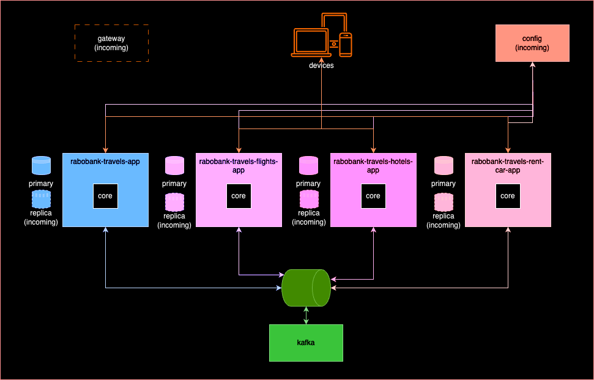

# AODEV-TRAVELS

This is a project for a test.

This project is about a travel agency and coverage this technologies:

- Pub/Sub pattern
- Centralized Configuration
- 

## Desing



## How can start?

To start this project it's necessary:

- IntelliJ
- Java 21+ (microsoft-21: https://learn.microsoft.com/pt-br/java/openjdk/download#openjdk-21)
- Docker
- Maven

To start:

1. go to devops dir and execute this command:

```shell
$ cd {project-dir}/devops
$ docker-compose up -d
```

2. then execute all project running Application class

- RabobankTravelsApplication (rabobank-travels-app)
- RabobankTravelsFlightsApplication (rabobank-travels-flights-app)
- RabobankTravelsHotelApplication (rabobank-travels-hotels-app)
- RobobankTravelsRentCarApplication (rabobank-travels-rent-car-app)

3. Import Insomnia requests.

### Next Steps

- CQRS
- Circuit Breaker
- API Proxy

### Docs
- https://www.baeldung.com/spring-kafka
